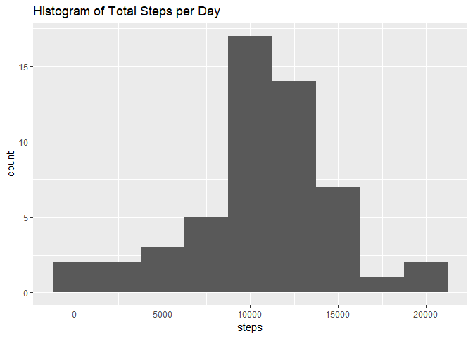
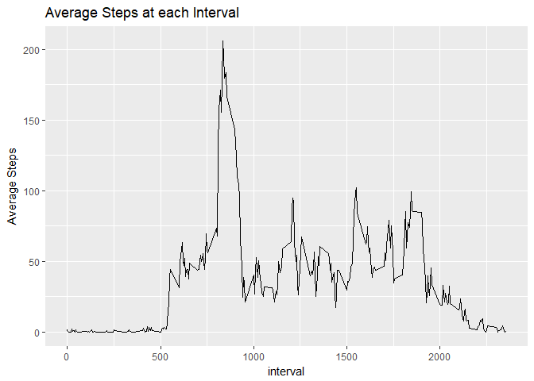
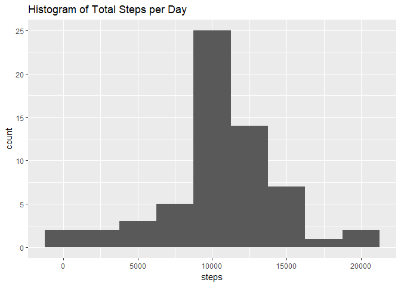
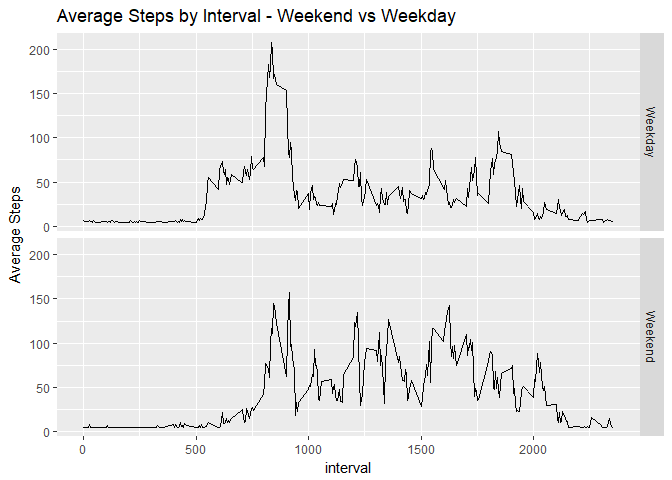

Reproducible Research Assignment 1
================

Load and Preprocess the Data
----------------------------

``` r
#load packages
library(ggplot2)
library(dplyr)
library(zoo)
library(data.table)
# Create a temporary directory to store the file

tf <- tempfile()
td <- tempdir()

# Load the file

zipData <- "https://github.com/JohnDuncanData/RepData_PeerAssessment1/raw/master/activity.zip"

download.file(zipData, tf, mode="wb")

#Unzip the zip file

FileNames <- unzip(tf, exdir=td)

#read the file as a table

FitData <- read.csv(FileNames[1])

knitr::opts_chunk$set(echo = TRUE)
```

What is the mean total number of steps taken per day?
-----------------------------------------------------

``` r
#Remove NA values and summarise days

FitDatanoNA <- FitData[complete.cases(FitData), ]

SumFitData <- FitDatanoNA %>%
  group_by(date) %>%
  summarise(steps=sum(steps))

#create charts and summary statistics

TotalStepHist <- ggplot(SumFitData, aes(x=steps)) + geom_histogram(binwidth = 2500) +ggtitle("Histogram of Total Steps per Day")
TotalStepHist
```



``` r
TotalStepsMean <- mean(SumFitData$steps)
TotalStepsMean
```

\[1\] 10766.19

``` r
TotalStepsMedian <- median(SumFitData$steps)
TotalStepsMedian
```

\[1\] 10765

What is the Average Daily Activity Pattern
------------------------------------------

``` r
IntervalFitData <- FitDatanoNA %>%
  group_by(interval) %>%
  summarise(steps=mean(steps))

IntervalTimeSeries <- ggplot(IntervalFitData, aes(x=interval, y=steps)) + geom_line() +ggtitle("Average Steps at each Interval")+ylab("Average Steps")

IntervalFitDataRank<- IntervalFitData[order(-IntervalFitData$steps),]
head(IntervalFitDataRank)
```

A tibble: 6 x 2
===============

interval steps <int> <dbl> 1 835 206. 2 840 196. 3 850 183. 4 845 180. 5 830 177. 6 820 171.

``` r
TopInterval <- IntervalFitDataRank$interval[1]

IntervalTimeSeries
```



``` r
TopInterval
```

\[1\] 835

Input Missing Values
--------------------

``` r
FitDataNA <- FitData[!complete.cases(FitData), ]
NACount <- length(FitDataNA$steps)
NACount
```

\[1\] 2304

``` r
# Replace NA with overall mean steps

FitDataTB <- data.table(FitData)
FitDataFixed <- FitDataTB[, steps := na.aggregate(steps)]

SumFitDataFixed <- FitDataFixed %>%
  group_by(date) %>%
  summarise(steps=sum(steps))

#create charts and summary statistics

TotalStepHist <- ggplot(SumFitDataFixed, aes(x=steps)) + geom_histogram(binwidth = 2500) +ggtitle("Histogram of Total Steps per Day")
TotalStepHist
```



``` r
TotalStepsMean <- mean(SumFitDataFixed$steps)
TotalStepsMean
```

\[1\] 10766.19

``` r
TotalStepsMedian <- median(SumFitDataFixed$steps)
TotalStepsMedian
```

\[1\] 10766.19 We can see that replacing the NA values with the average has shifted the median to equal the mean

Are there differences in activity patterns on Weekdays and Weekends?
--------------------------------------------------------------------

``` r
FitDataFixed$date2 <- as.Date(FitDataFixed$date)
Weekday <- weekdays(FitDataFixed$date2)

FitDataFixed$Weekend <- with(FitDataFixed, ifelse(
  Weekday == "Saturday", "Weekend", ifelse(
    Weekday == "Sunday", "Weekend", "Weekday")
)
)

WeekendFitData <- FitDataFixed %>%
  group_by(interval,Weekend) %>%
  summarise(steps=mean(steps))

Weekendplot <- ggplot(WeekendFitData, aes(x=interval, y=steps)) +geom_line()+facet_grid(Weekend ~.)+ylab("Average Steps")+ggtitle("Average Steps by Interval - Weekend vs Weekday")
Weekendplot
```


